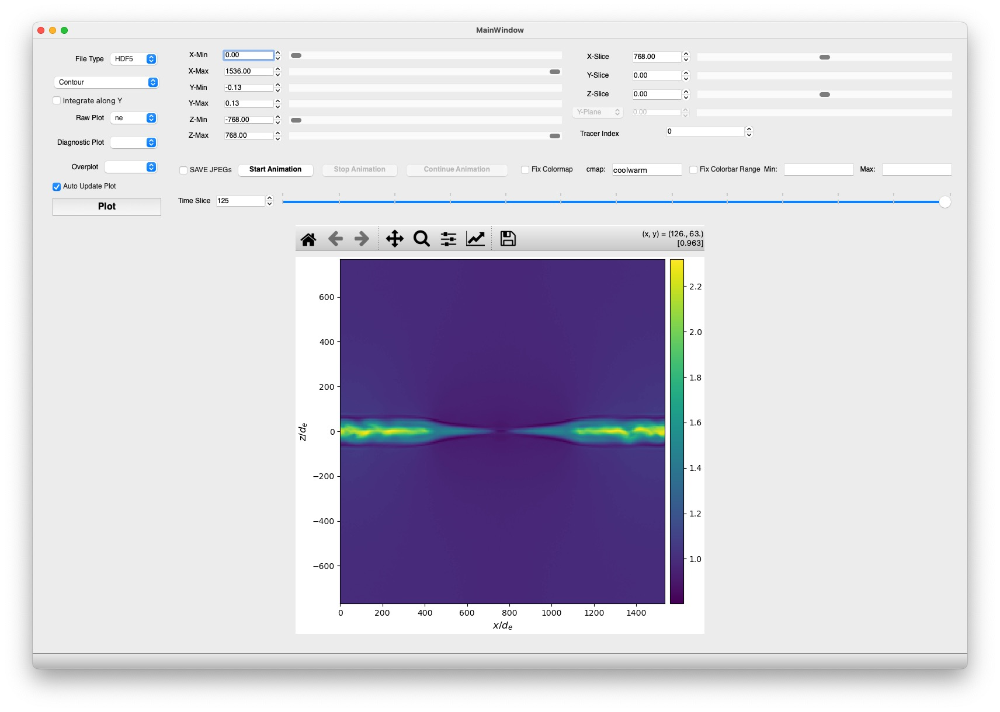

# VPIC Quick Check

Interactive visualization tool for VPIC (Vector Particle-In-Cell) simulation data.

## Features

- **Interactive 2D/3D visualization** of electromagnetic fields, particle hydro quantities, and diagnostics
- **Diagnostic plots**: j.E (energy dissipation), beta production (hybridVPIC), turbulence mixing
- **Multiple plot types**: Contours, 1D slices, averages
- **Animation** support for time series
- **Tracer particle** visualization with energy evolution
- **Flexible configuration** via YAML files or command-line arguments
- **Auto-detection** of data format, file structure, and particle species
- **Multi-species support**: Automatically detects ion species from hydro files (ideal for hybridVPIC)



## Installation

### Quick Install

In the VPIC run directory:

```bash
git clone https://github.com/xiaocanli/quick_check_vpic
cd quick_check_vpic
pip install .
```

### Requirements

```bash
pip install numpy matplotlib h5py PySide6
```

### Optional

```bash
pip install pyyaml  # For YAML configuration files
```

### Platform-Specific Notes

**Perlmutter@NERSC**: Use a conda environment and access via [NERSC ThinLinc](https://docs.nersc.gov/connect/thinlinc/) for better performance. ThinLinc provides a remote desktop environment that is much faster than X11 forwarding over SSH. See [NERSC Python docs](https://docs.nersc.gov/development/languages/python/nersc-python/) for setting up your Python environment.

### HPC Offline Installation

For HPC systems without internet access (e.g., air-gapped or restricted networks), you can prepare packages offline:

#### On a machine with internet access:

```bash
# Create a directory for wheels
mkdir wheelhouse
cd wheelhouse

# Download all required packages
pip download numpy matplotlib h5py PySide6 pyyaml
```

#### Transfer to HPC and install:

```bash
# Copy the wheelhouse directory to your HPC system
# Then on the HPC system:
pip install --no-index --find-links=wheelhouse -r requirements.txt
```

Create a `requirements.txt` file:
```
numpy>=1.22
matplotlib>=3.6
h5py>=3
PySide6==6.4.3
pyyaml
```

**Note**: Make sure to download wheels for the correct Python version and platform that matches your HPC system. You can specify the platform when downloading:

```bash
pip download --platform manylinux2014_x86_64 --python-version 3.10 --only-binary=:all: numpy matplotlib h5py PySide6 pyyaml
```

## Quick Start

### 1. Auto-Detection Mode (Easiest - **NEW!**)

Simply run from your VPIC run directory:

```bash
cd /path/to/vpic/run/directory
python quick_check_vpic.py
```

The tool will automatically:
- Detect HDF5 vs GDA data format
- Find smoothed data directories
- Identify turbulence mixing simulations
- Load the VPIC info file

### 2. Using Configuration Files (**NEW!**)

Create a `config.yaml` file (copy from `config_example.yaml`):

```yaml
# config.yaml
data:
  hdf5_fields: true
  smoothed_data: true
  smooth_factor: 2

time:
  tmin: 0
  tmax: 100
```

Then run:

```bash
python quick_check_vpic.py --config config.yaml
```

### 3. Command-Line Arguments (**NEW!**)

Override settings directly:

```bash
# Use HDF5 format, time range 10-50
python quick_check_vpic.py --hdf5 --tmin 10 --tmax 50

# Use GDA format without smoothing
python quick_check_vpic.py --gda --no-smooth
```

## Configuration

### Configuration Priority (**NEW!**)

Settings are applied in this order (later overrides earlier):

1. Default values
2. Auto-detected settings
3. `config_example.yaml` (if present)
4. `config.yaml` (if present)
5. Specified config file (`--config`)
6. Command-line arguments

### Configuration Options

Create `config.yaml` in your quick_check_vpic directory:

```yaml
# Data format and location
data:
  hdf5_fields: true          # true for HDF5, false for GDA
  smoothed_data: true        # Use smoothed data
  smooth_factor: 2           # Smoothing factor (if smoothed)
  dir_smooth_data: "data_smooth"  # Smoothed data directory
  dir_fields_hdf5: "field_hdf5"   # Field directory: "field_hdf5" (old VPIC) or "fields_hdf5" (new VPIC)
  hdf5_data_order: "xyz"     # HDF5 data organization: "xyz" (older VPIC) or "zyx" (newer VPIC)
  momentum_field: true       # Momentum data available
  time_averaged_field: false # Time-averaged fields
  turbulence_mixing: false   # Turbulence mixing simulation
  auto_detect_species: true  # Auto-detect species from hydro files (recommended for hybridVPIC)
  # species_list: ["electron", "H"]  # Manually specify species (only if auto_detect_species is false)

# Time parameters
time:
  tmin: 0                    # Start frame
  tmax: 52                   # End frame
  animation_tinterval: 100   # Animation interval (ms)

# Tracer particles
tracer:
  filepath: "/path/to/tracer/data/"
  filename: "electrons_ntraj1000_10emax.h5p"

# VPIC simulation info files
info_file: "../info"         # Path to VPIC info file
log_file: "../vpic.out"      # Path to VPIC log file (fallback if info file not found)
```

### Species Detection (**NEW!**)

The tool now automatically detects particle species from hydro files, making it compatible with both regular VPIC (with electrons) and hybridVPIC simulations (ion-only or multiple ion species).

**Auto-detection (recommended)**:
```yaml
data:
  auto_detect_species: true  # Automatically finds all species from hydro files
```

When enabled, the tool scans the hydro directory and discovers all available species (e.g., `electron`, `H`, `ion`, `dion`, `hion`). On startup, you'll see:
```
Auto-detected species: electron, H
```

**Manual specification**:
For fine-grained control or when auto-detection doesn't work:
```yaml
data:
  auto_detect_species: false
  species_list: ["ion", "dion", "hion"]  # Specify exactly which species to load
```

**Use cases**:
- **Regular VPIC**: Auto-detects `electron` and ion species (e.g., `H`, `He`)
- **HybridVPIC**: Auto-detects multiple ion species (e.g., `ion`, `dion`, `hion`) without electrons
- **Custom simulations**: Manually specify any species combination

## Usage Guide

### Main Window

The main window provides:

- **Variable selection**: Choose electromagnetic fields, hydro quantities, or diagnostics
- **Plot type**: Contour, contour+slice, contour+average
- **Time control**: Slider and spinbox for frame selection
- **Spatial range**: X, Y, Z range selectors
- **Animation**: Play through time series with optional JPEG saving

### Plot Types

1. **Contour**: 2D color map of selected variable
2. **Contour + X/Y/Z Average**: 2D map with averaged 1D profile
3. **Contour + X/Y/Z Slice**: 2D map with 1D slice at specified position

### Controls

- **Time Frame**: Navigate through simulation timesteps
- **X/Y/Z Min/Max**: Set spatial extent to visualize
- **Plane**: Select normal direction for 2D slicing (3D sims only)
- **Auto-update**: Automatically refresh plot when parameters change
- **Integrate**: Integrate along normal direction
- **Fix colormap/colorbar**: Lock color scheme and range

### Diagnostic Plots

Select diagnostic plots from the **Diagnostic plot** dropdown. Available diagnostics:

- **jdotE**: Energy dissipation (j·E). Shows where electromagnetic energy is converted to particle energy. Available for all simulations.

- **beta**: Beta production diagnostics. Shows heating rate due to perpendicular and parallel pressure anisotropies in collisionless plasmas. Particularly useful for hybridVPIC simulations analyzing ion heating mechanisms. Requires `hydro-int-hdf5` directory with `hydro_beta_*.h5` files.

- **emix**: Electron mixing fraction (for turbulence mixing simulations only). Shows `(ne_bot - ne_top) / (ne_bot + ne_top)`.

If beta files are not found, the tool will display a warning message and show a zero field.

### Tracer Particles

Tracer trajectories are assumed to be in HDF5 format with each tracer in an individual group.

1. Plot a field image first
2. Select "trajectory" from the overplot dropdown
3. Choose tracer index with spinbox
4. Visualize particle trajectory colored by energy
5. Inset plot shows energy vs time

Configure tracer paths in `config.yaml` or set `tracer_filepath` and `tracer_filename` in the code.

### Animation

1. Click "Start Animation" to play through time
2. Optionally enable "Save JPEGs" to export frames to `./img/`
3. Use "Stop" and "Continue" to control playback

## Command-Line Reference (**NEW!**)

```
usage: quick_check_vpic.py [-h] [-c CONFIG] [--info-file INFO_FILE]
                           [--log-file LOG_FILE] [--hdf5] [--gda]
                           [--smooth] [--no-smooth] [--tmin TMIN]
                           [--tmax TMAX] [--no-auto-detect]

Options:
  -h, --help            Show help message
  -c, --config CONFIG   Path to YAML configuration file
  --info-file INFO_FILE Path to VPIC info file (default: ../info)
  --log-file LOG_FILE   Path to VPIC log file (default: ../vpic.out)
  --hdf5                Force HDF5 field format
  --gda                 Force GDA field format
  --smooth              Force smoothed data mode
  --no-smooth           Force non-smoothed data mode
  --tmin TMIN           Minimum time frame
  --tmax TMAX           Maximum time frame
  --no-auto-detect      Disable auto-detection
```

## File Structure

Expected directory structure (from run directory):

```
run_directory/
├── info                    # VPIC simulation info (preferred)
├── vpic.out               # VPIC log file (fallback if info missing)
├── field_hdf5/            # HDF5 fields (old VPIC) or
├── fields_hdf5/           # HDF5 fields (new VPIC) or
├── data/                  # GDA fields
├── data_smooth/           # Smoothed data (optional)
├── hydro_hdf5/            # Hydro data
└── quick_check_vpic/      # This tool
    ├── quick_check_vpic.py
    ├── mainwindow.py
    ├── mainwindow.ui
    ├── config.yaml        # Your config (optional)
    └── config_example.yaml
```

## Troubleshooting

### "VPIC info file not found"

The tool will automatically try to read from `../vpic.out` log file if the `info` file is not found. This is useful for:
- Older simulations that don't have an `info` file
- hybridVPIC runs that output parameters to the log file

If both files are missing, ensure one exists relative to where you run the script, or specify:

```bash
python quick_check_vpic.py --info-file /path/to/info
```

### "Auto-detected: HDF5 field format" but you have GDA

Override with:

```bash
python quick_check_vpic.py --gda
```

### Plots not updating when moving sliders

1. Enable "Auto-update" checkbox
2. Click "Plot" button after adjusting parameters

### Array dimension mismatch

This can happen with:

1. **Smoothed data**: Verify `smooth_factor` matches your data:
   ```bash
   python quick_check_vpic.py --smooth-factor 2
   ```
   Or disable smoothing:
   ```bash
   python quick_check_vpic.py --no-smooth
   ```

2. **Wrong HDF5 data order**: Newer VPIC versions organize data as (nz, ny, nx) instead of (nx, ny, nz).
   Update your `config.yaml`:
   ```yaml
   data:
     hdf5_data_order: "zyx"  # For newer VPIC versions
   ```
   Or use "xyz" for older versions (default)

### Missing PyYAML warning

Install PyYAML for config file support:

```bash
pip install pyyaml
```

The tool will still work with auto-detection or command-line args.

## Examples

### Example 1: Quick visualization with auto-detection

```bash
cd my_vpic_run
python quick_check_vpic/quick_check_vpic.py
# Select variable (e.g., "ex")
# Click "Start Animation"
```

### Example 2: Analyze specific time range

```bash
python quick_check_vpic.py --tmin 50 --tmax 100
```

### Example 3: Compare smoothed vs raw data

```bash
# Terminal 1: Smoothed
python quick_check_vpic.py --smooth

# Terminal 2: Raw
python quick_check_vpic.py --no-smooth
```

### Example 4: Custom configuration for production runs

Create `production_config.yaml`:
```yaml
data:
  hdf5_fields: true
  smoothed_data: true
  smooth_factor: 4
time:
  tmin: 0
  tmax: 500
```

Then:
```bash
python quick_check_vpic.py -c production_config.yaml
```

## Customization

### Modifying the GUI

The layout `mainwindow.ui` is created using Qt Creator (free). To modify:

1. Edit `mainwindow.ui` in Qt Creator
2. Convert to Python:
```bash
pyside6-uic mainwindow.ui -o mainwindow.py
```

### Adding New Variables

To add new variables or diagnostics:

1. `raw_plot_variables()`: Add to variable lists
2. `read_data()`: Add data reading logic if needed
3. `diag_plot_variables()`: For new diagnostics

## Development

### Code Structure

- `Config`: Configuration dataclass with YAML loading and auto-detection
- `load_config()`: Configuration loading with fallback chain
- `TracerData`: Tracer particle data management
- `MplCanvas`: Matplotlib Qt integration
- `MainWindow`: Main GUI and visualization logic

### Recent Improvements (v2.0)

- **Configuration system**: YAML files + command-line arguments
- **Auto-detection**: Automatically detect data format and structure
- **Better error handling**: Clearer error messages
- **Type hints**: Full type annotations for better IDE support
- **Bug fixes**: Fixed array dimension mismatches for smoothed data

## Tips

1. **First time**: Use auto-detection to see what the tool finds
2. **Save config**: Once you find good settings, save to `config.yaml`
3. **Quick tests**: Use command-line args for one-off changes
4. **Animation**: Disable auto-update during animation for better performance
5. **Large datasets**: Use spatial range selectors to focus on regions of interest

## Issues

Please submit issues on GitHub or contact the maintainer:
- GitHub: https://github.com/xiaocanli/quick_check_vpic/issues

## Version History

- **v2.2**:
  - **Dynamic species detection**: Automatically detects particle species from hydro files
  - **Beta production diagnostics**: Added beta heating diagnostics for hybridVPIC simulations
  - Reads field and hydro variables dynamically from HDF5 files instead of hardcoding
  - Full support for hybridVPIC with multiple ion species (ion-only simulations)
  - Added `auto_detect_species` and `species_list` configuration options
  - Compatible with simulations having arbitrary species combinations
- **v2.1**:
  - Added support for reading VPIC info from `vpic.out` log file (fallback when `info` file is missing)
  - Added HPC offline package installation documentation
  - Improved compatibility with hybridVPIC simulations
  - Configurable log file path
- **v2.0**: Refactored with configuration system, auto-detection, type hints, and bug fixes
- **v1.x**: Original implementation

---

**Note**: This tool is designed for quick visualization and analysis. For publication-quality figures or detailed analysis, consider using dedicated analysis scripts.
